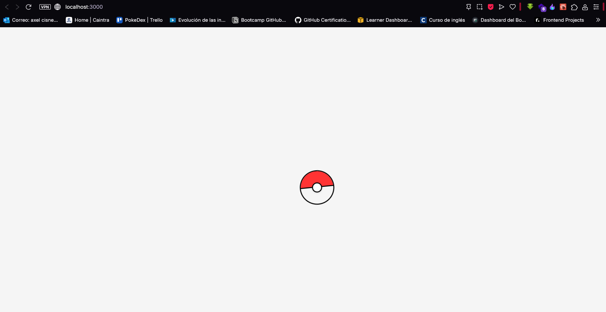
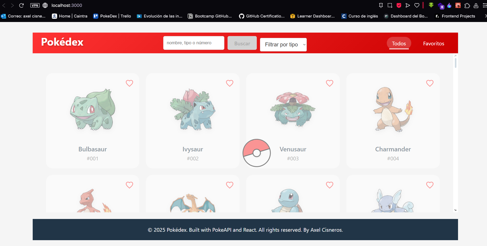
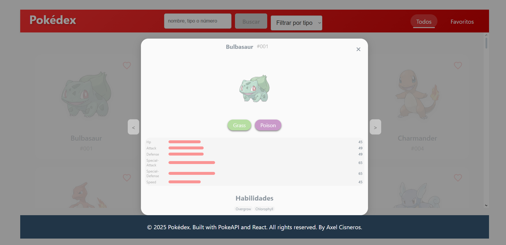
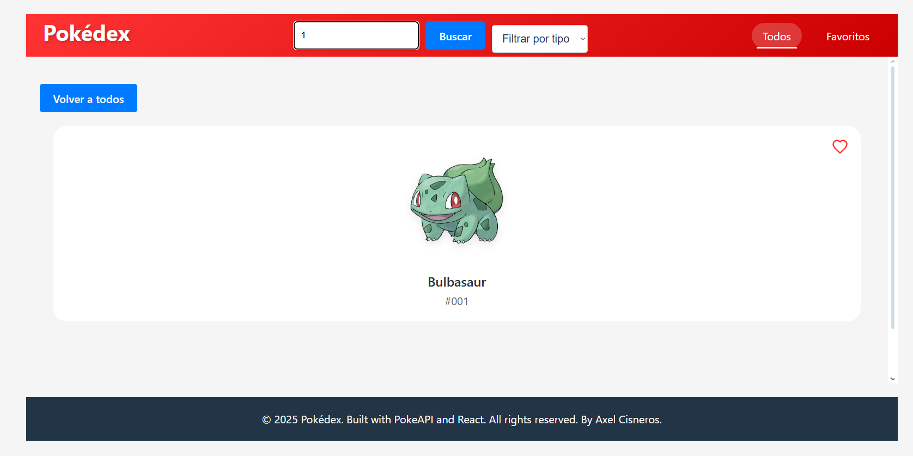
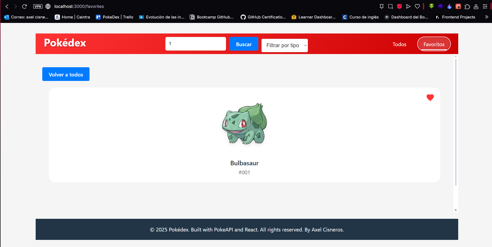
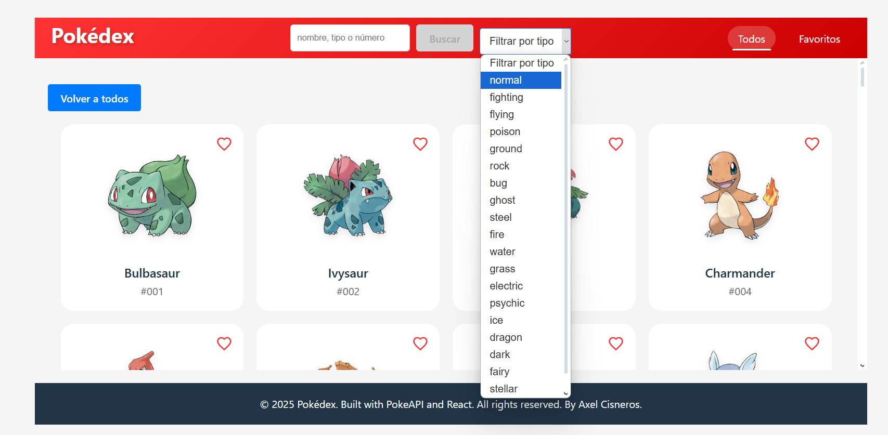

# Proyecto Final Frontend

Este proyecto es una aplicación web desarrollada como parte del proyecto final del curso. Es una Pokedex interactiva que permite a los usuarios buscar y explorar información sobre diferentes Pokémon.

## Capturas del Proyecto

A continuación, se presentan algunas capturas de pantalla del proyecto:

## Tecnologías Utilizadas

- **React**: Biblioteca de JavaScript para construir interfaces de usuario.
- **Vite**: Herramienta de construcción rápida para proyectos web modernos.
- **CSS**: Utilizado para el diseño y estilo de la aplicación.
- **JavaScript (ES6+)**: Lenguaje de programación principal.
- **PokeAPI**: API utilizada para obtener datos de los Pokémon.

## Propiedades de CSS

El proyecto utiliza las siguientes propiedades de CSS para el diseño y estilo:

- Flexbox y Grid para la disposición de los elementos.
- Variables CSS para mantener consistencia en colores y fuentes.
- Media queries para diseño responsivo.
- Animaciones y transiciones para mejorar la experiencia del usuario.

## Estructura del Proyecto

El proyecto está organizado en componentes reutilizables dentro de la carpeta `src/components`. Cada componente tiene su propio archivo `.jsx` y `.css`.

## Dependencias

- **react**: ^18.0.0
- **react-dom**: ^18.0.0
- **vite**: ^4.0.0

## Dependencias de Desarrollo

- **@vitejs/plugin-react**: ^4.0.0
- **eslint**: ^8.0.0
- **eslint-config-react-app**: ^7.0.0

## Cómo Ejecutar el Proyecto

1. Clona este repositorio.
2. Instala las dependencias con `npm install`.
3. Inicia el servidor de desarrollo con `npm run dev`.
4. Abre [http://localhost:3000](http://localhost:3000) en tu navegador.
